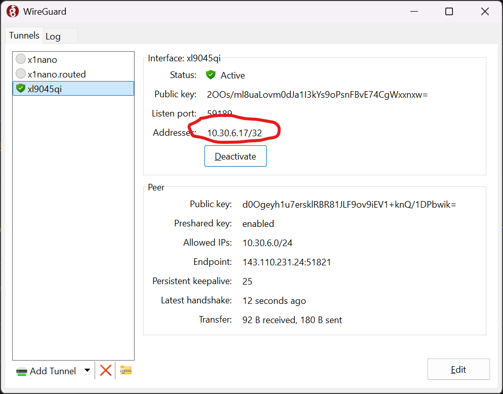
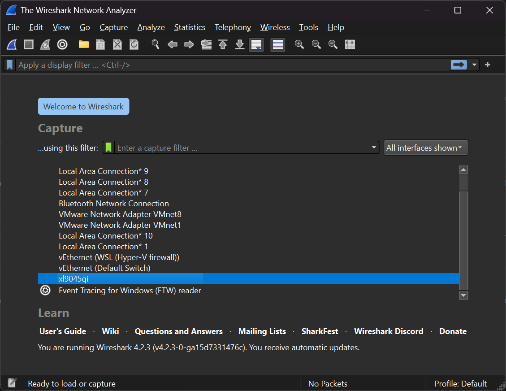
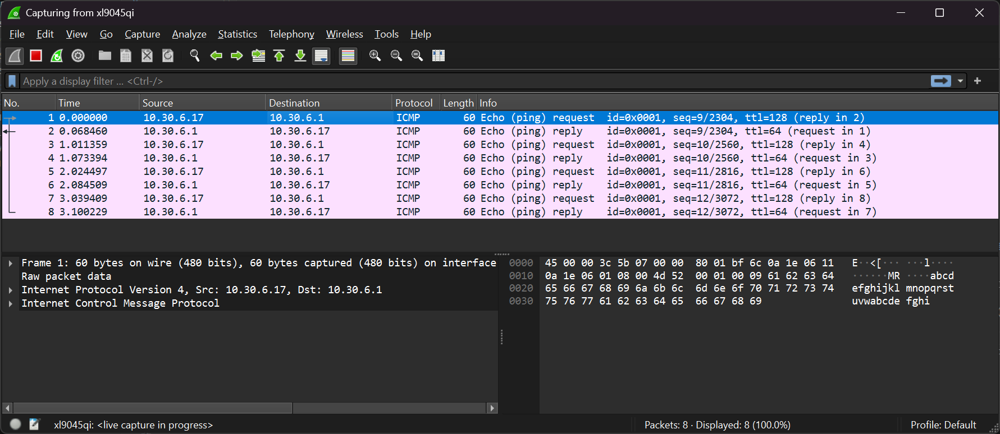

# Group Assignment 1

This simple packet sniffing exercise will both verify that you are able to communicate with your groupmates via the class VPN and that you get some experience using packet sniffing tools, specifically Wireshark.

## Steps

All group members should perform these steps together.

1\. Install Wireshark - installers are available in the software repository link on D2L.

1. Connect to the CS 306 VPN. See the [instructions](VPN.md) if you need assistance.

1. Each member of your group should determine your VPN IP address - it's displayed in the WireGuard interface. Share your IP with your group members.

     

1. All group members **who are using Windows** will need to enable ping packets through the Windows Firewall.

    Before starting the next steps, open an Administrator command prompt and run this command:

    `netsh advfirewall firewall set rule name="File and Printer Sharing (Echo Request - ICMPv4-In)" new enable=Yes`

    Feel free to copy/paste the command.

    > Tip: Press Windows+R to bring up the Run dialog, type `cmd`, and press Ctrl+Shift+Enter. This is a shortcut that will run the command typed as administrator.

1. Start Wireshark. Set it to capture on your WireGuard interface. It will be named with your StarID.

     

1. Use the `ping` command to ping both of your group member's IP addresses. **You should see both the ping and the ping reply in the Wireshark capture log.** It is OK if other packets appear - this is normal, as network stacks are pretty "chatty" on their own.

    > Windows will only send four ping packets before exiting. Mac and Linux machines will ping forever until you stop the ping program by pressing Ctrl+C.

    Here is an example of a successful ping:

     

1. Once you've pinged *both* group members, **stop** the capture (under the Capture menu) and *save the capture file* using your first name and last initial as the capture file name (e.g. `flintm`). The file should get an extension of `.cap`, `.pcap`, or `.pcapng` - any is OK.

    > In the event that your group has two members with the same first name and same last initial, you can use your full last name in the filename, but do *not* include any separators - i.e. `flintmillion`, not `flint-million`, `flint_million`, `flint.million` etc.

1. Have one group member collect the capture files for each group member and submit the files to the D2L dropbox for your group as one submission.

> If you disabled the Windows Firewall rule that blocks pings, this command will turn that rule back on:
>
> `netsh advfirewall firewall set rule name="File and Printer Sharing (Echo Request - ICMPv4-In)" new enable=No`
>
> Remember that you need to run the command on an Administrator command prompt.

## If you have trouble

If you are finding that you cannot ping a group member *but that group member* ***can*** *ping you*, then it suggests that person might have a restrictive firewall installed on their computer.

Check if you have any extra firewall applications installed other than the default built-in system firewall. If so, disable those firewall applications *temporarily* during the assignment.

## Submission

Your submission must include:

* **One** packet capture file for *each* member of your group.

> You must do this activity **together** as a group - each member should submit **one** capture file that contains **both** pings. A group member submitting two or more separate capture files will result in some point loss for your group!

You don't need to be in person to do this activity as a group - in fact, doing it when you are each on separate connections is further "evidence" that the VPN is allowing you to connect to your group members' computers! You can freely use the Internet normally while connected to the VPN (the VPN profile is not configured to route your entire Internet connection - just the connection to the VPN IP range), so you can use Zoom or another conferencing system to communicate remotely.

The assignment submission must be made by your group **by 11:59 PM on February 25th**.

## Scoring Rubric

This assignment is worth 50 points. Points are assigned as follows:

| Item | Points | Penalties |
|-|-|-|
| Provide **one** capture file per group member, containing pings of all other group members | 50 | 10 points lost per member with more than one capture file. 20 points lost if a group member's capture file is missing completely.

