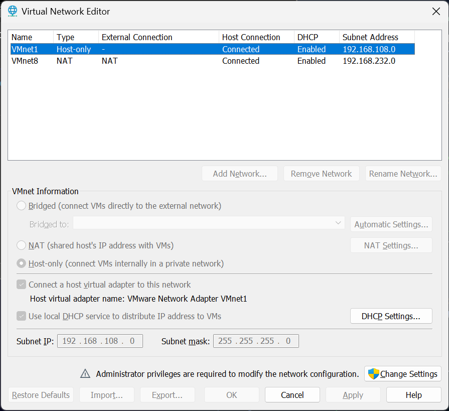
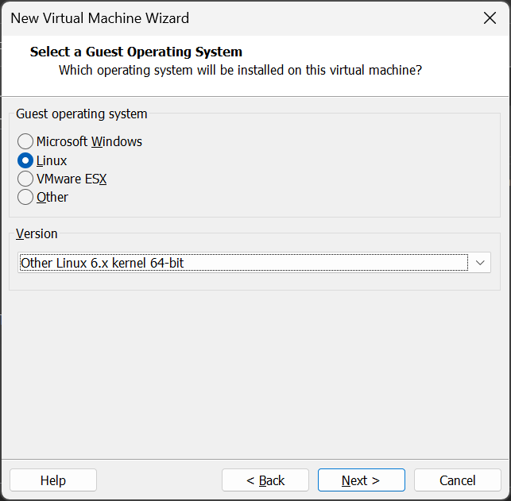
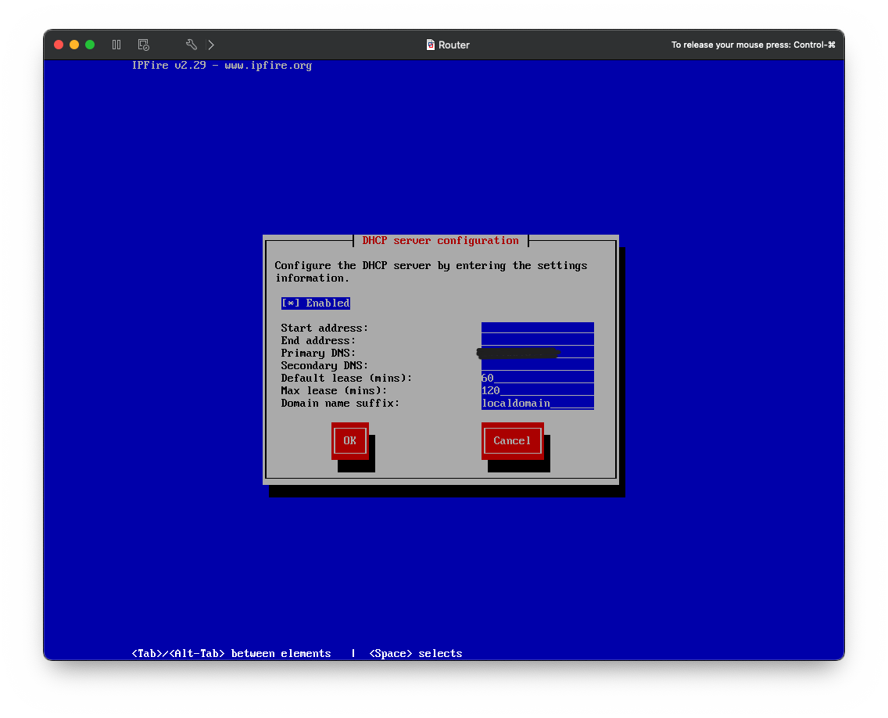
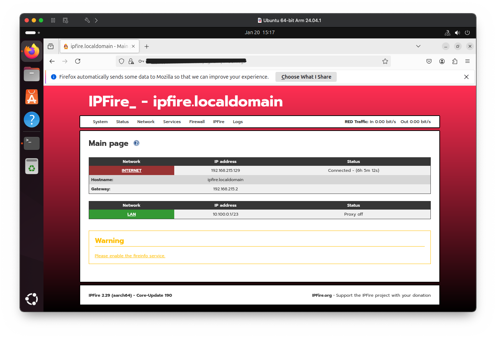
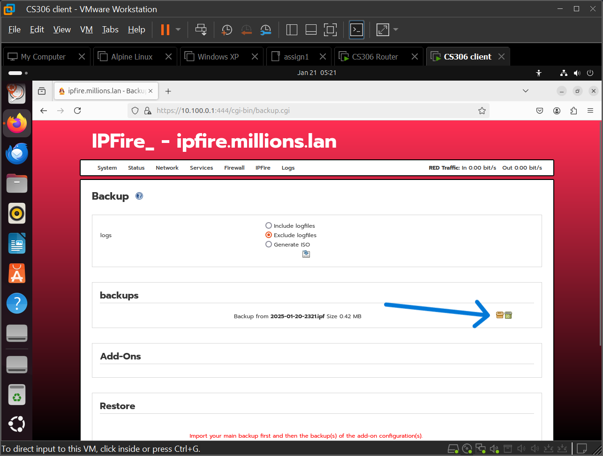

# Individual Assignment 1 - Setting Up Your Own Network

In this exercise you will set up your own private network using two virtual machines. This setup will mimic the configuration of the vast majority of home networks and routers. In particular, we will be using an operating system that, using only software, performs the same exact functions that your home router performs, and we will connect that "router" to a private, internal network that only your VMs can access.

While on the surface this may seem pointless - your VMs can generally access the Internet directly anyway - the point is that we can build upon this setup in the future to build more advanced networking scenarios, explore firewalling, learn about routing, and other aspects that the default "barebones" network stack in VMware simply doesn't allow.

There are five major phases to this assignment as follows:

## Phase 1: Install VMware.

If you have not already, [install VMware](VMWARE.md) using the instructions provided in the link. Installing VMware itself is relatively straightforward; if you already have it on your machine you've already finished this step!

## Phase 2: Configure VMware Networking

By default, VMware lets you configure a virtual machine's networking in one of three ways:

* NAT (the default): VMware itself runs a "barebones" routing engine to let your virtual machines access the Internet via the connection you already have on your computer.
* Bridged: VMware implements a "virtual switch" so that your virtual machine can logically appear to be on the same broadcast network as your computer itself is. This allows you to have two (or more) "computers" appear on the network, even though only your one physical computer is connected.

    > A caveat for bridged mode is that many Wi-Fi networks do not support it. Wired Ethernet connections will generally work fine, but Wi-Fi networks use the MAC address as part of the authentication protocol. VMware's virtual switch works by assigning your computer an additional "virtual" MAC address; any traffic coming to that MAC address is directed to the VM, and any traffic generated by the VM is transmitted using that MAC address. (This is exactly how switches aggregate many computers onto one cable.) Since Wi-Fi networks often implement "MAC spoofing protection", your VMs may not be able to access the network at all.

* Host-Only: Your VM is connected to a virtual network that is *not* routed to the Internet. It is similar to the NAT choice, but the mini routing service is not running on the network.

The instructions for configuring the networking system for our project differ depending on whether you are on Mac or Windows/Linux:

### Windows/Linux

1. In VMware's main window, open the Virtual Network Editor, found under the Edit menu. The window looks like this:

    

    In this window, you can see the two networks that provide both the NAT and Host-Only networks for VMware's default options.

    On Windows you'll need to click the "Change Settings" button to give yourself admin-level access to change the virtual network settings. You can tell if you have admin access because you'll see an additional "Bridged" network in the list - you can now see all three virtual networks used by VMware.

2. We are going to add a new custom network to serve as our "internal" network. Click the "Add" button. You'll be asked to select a network to add - choose "VMnet2". 

    

    Click OK.

3. You'll now see a new network appear in the list of virtual networks named VMnet2. Click the network.

    Uncheck *both* the "Connect a host virtual adapter..." and the "Use local DHCP service..." checkboxes.

    Click the Apply button at the bottom of the window.

    

4. Finally, click the "Rename Network" button under the list of networks. Change the name from "VMnet2" to "CS306". This will help you remember which network is your internal network for projects.

    Your final view should look like this:

    

5. Click OK to close the virtual network editor.

What we have just done is to configure an additional fourth network option for your virtual machines' networking. 

> You may wonder why we didn't just use the existing Host-Only network. While we could have done that by changing its settings, it's generally a better idea to create a new virtual network when you are working with advanced networking scenarios. Even if you use Host-Only networking, VMware does still offer certain services by default, such as DHCP for IP address assignment. We will be providing DHCP ourselves as part of the project, so we have created a network such that VMware does not provide any network services at all to the network, nor does that network have any "connection" to the host itself. In a sense, this is even less than "host-only", it's "completely isolated".

### Mac

## Phase 3.1: Installing a Router Operating System

In this phase we will create a virtual machine and install an operating system that is designed to act as a router. This is the same type of software that runs on your own home or office router. (As a matter of fact, most home routers today are simply running Linux along with some custom software to provide a web-based configuration interface - we're going to essentially install the "generic" version of this type of system.)

Download the IPFire installation image for your platform from the software repository linked on the D2L site.

* Windows or Linux: `ipfire-2.29-core190-x86_64.iso`
* Mac: `ipfire-2.29-core190-aarch64.iso`

Here are the specific instructions for each platform to get the new virtual machine created:

### Windows - Create a VM

1. Select New Virtual Machine from the File menu in VMware.

2. The New VM wizard will appear. **Choose to do a Custom installation** and choose Next.

    

3. On the next wizard screen, leave the default "Workstation 17.x" selected and click Next.

4. On the Guest OS screen, choose "I will install the operating system later"

    

    > Do NOT select the ISO image here. If you do, VMware will try to auto-detect the image OS and will configure the VM incorrectly. We are going to specify the exact settings for the VM in later steps.

5. On the next screen, select "Linux" as the main OS type, and "Other Linux 6.x Kernel 64-Bit" for the version.

    

    > The IPFire software router runs on Linux, hence why we tell VMware that we're building a Linux VM. Since IPFire is not a "standard" distribution (such as Ubuntu, Debian, etc.) we can use the "Other" option to set sensible defaults for a Linux-based VM.

6. Give your VM a name on the next screen - "Router" or "CS306 Router" is a good choice. We will use this setup throughout the course!

7. You can leave the processor settings at default. Go to the next screen.

8. Increase the default RAM to 1024 MB.

    

    Go to the next screen.

9. Leave "Network Address Translation" selected. Go to the next screen.

10. Continue proceeding through the screens. Leave all of the screens regarding storage controllers and virtual disks at their default. 

    > 8 GB is the default size for unspecified Linux distributions in VMware. You could change this, but 8 GB is more than sufficient to contain the software needed to act as a router.
    >
    > Fun fact: many home routers and cable modems run a stripped down Linux distribution in under 8 *megabytes* of space - this includes the web interface and all of the drivers to run the network hardware itself.

11. You'll now arrive at the final summary screen. *Don't* click Finish - instead, we will click "Customize Hardware."

    

12. In the Hardware window, click the Add button at the bottom of the hardware list. Select "Network Adapter" in the box that appears, and click Finish.

13. In the list of hardware, select "Network Adapter 2". 

    On the right panel, **choose the Custom option** for the network connection, and choose the "CS306" network you created as the network from the list.

    

14. Now, choose the CD/DVD drive. 

    Select the "Use ISO Image" option on the right panel, and then click the Browse button and locate the IPFire installation ISO (`ipfire-2.29-core190-x86_64.iso`).

15. Click Close. You'll be brought back to the VM creation summary screen. You can now finally click Finish.

    Go on to Phase 3.2 to set up the router!

### Mac - Create a VM

1. In VMware, create a new virtual machine. You should get the following display:

    

    Select the "Create a custom VM" option.

2. Select "Linux" as the OS category, and choose "Other Linux 6.x ARM" as the OS type.

    

    > The IPFire software router runs on Linux, hence why we tell VMware that we're building a Linux VM. Since IPFire is not a "standard" distribution (such as Ubuntu, Debian, etc.) we can use the "Other" option to set sensible defaults for a Linux-based VM.

3. Use the defaults for the virtual disk. 

    

    > 8 GB is the default size for unspecified Linux distributions in VMware. You could change this, but 8 GB is more than sufficient to contain the software needed to act as a router.
    >
    > Fun fact: many home routers and cable modems run a stripped down Linux distribution in under 8 *megabytes* of space - this includes the web interface and all of the drivers to run the network hardware itself.

4. On the next screen, *don't* click Finish - instead, we will click "Customize Settings."

    

    You'll be prompted to save the VM once you click the Customize button. Name the VM something sensible - a good name would be "router".

    

    You'll next see the VM configuration interface.

    

    > **Note:** Should you accidentally click Finish, you can still access the VM settings by choosing "Settings" under the Virtual Machine menu, or by pressing &#x2318; + E.

5. Click the "Add Device" text in the top right of the window. You will be asked to choose what type of device you want to add. Choose "Network Adapter". You'll be brought to a configuration screen to setup your new adapter.

    In the settings dialog, **choose the "vmnet2" network you created in Phase 2.**

    

    This will cause a second network adapter to be added to your VM which will be connected to the virtual, internal network.

    Click OK.

6. Back at the main VM settings window, open the CD/DVD settings. **Select the ISO image you downloaded** (`ipfire-2.29-core190-aarch64.iso`) and **ensure the "Connect CD/DVD Drive" checkbox is checked.**

    

7. Close the VM settings window and go on to Phase 3.2!
8. 
## Phase 3.2: Configuring the Router

These instructions are very similar for Windows or Mac, with only one small variation which will be noted.

1. Finally, start up the virtual machine.

    If you see one of the following displays, press Enter to immediately boot into the installation. (It will start on its own if you don't.) 

    

    

2. Work through the installation. For most questions, you can accept the defaults. Select an appropriate language/localization option if it applies for you. Allow the installer to partition the disk automatically, selecting defaults.

    > Hint: The setup program is keyboard-driven - mouse support may either be unstable or completely non-existent. Simply use your arrow keys and the Tab key to navigate the controls in the dialog boxes. Space will check checkboxes. 

3. Once you have completed installation, you will see this display. 

    

    Once you choose Reboot, the VM will reboot into the router's initial setup wizard.

4. When the router boots, you'll first see the boot menu. 

    

    Like with the setup program, you can either wait a few moments for the OS to boot, or you can press Enter to boot it immediately.

5. Work through the initial questions in the first-setup wizard. For questions such as time zone, language, etc. select something appropriate for you. 

    

    When asked to enter a domain name, **enter** `yourlastname.lan`. Obviously, replace `yourlastname` with your last name. Don't include any capitalization, hyphens or punctuation. Examples: `million.lan`, `omally.lan`, `mcdonaldsmith.lan`, etc.
    
6. Proceed **until** you are given the *Network Configuration* window, which prompts: "Current config: GREEN + RED". **STOP** on this screen and proceed to the next step.

    

    > *Note:*
    >
    > You may use the same password for both admin and root if you desire. Please make sure you make a note of your password!
    >
    > The user interface will show *nothing* when you type your password in the password fields - **this is normal**. Be careful as you type!

7. The GREEN + RED setting is the correct default setting, however we now need to identify which virtual network card is connected to which interface.

    > **Windows**:
    >
    > Open your Virtual Machine's settings by choosing Settings from the VM menu.
    >
    > Select the *second* network adapter ("Network Adapter 2", not "Network Adapter").
    >
    > In the right pane, click the Advanced button. **Make a note of the virtual network card's MAC address**
    >
    > 

    > **Mac**: 
    > 
    > Open the Virtual Machine settings by choosing Settings from the VM menu. (Alternatively, press Ctrl + &#x2318; to release input from the VM, then press &#x2318; + E.)
    >
    > Open the *second* network adapter ("Network Adapter 2", not "Network Adapter").
    >
    > In the network configuration screen, open the Advanced Settings section. **Make a note of the virtual network card's MAC address**.
    >
    > 

8. Select "Drivers and card assignments". The GREEN network will be selected. 

    Press Enter on the network.

    Select the network adapter that **matches the MAC address you noted in step 3.** 

    > IPFire uses the concept of colors to specify network "zones". The Green network is your internal, private local area network, while the Red network is your connection to the Internet.

    Repeat the above step to select the interface for the RED network - it should be the only one listed now.

    Your screen should look similar to this:

    

    Choose Done.

9. Choose "Address Settings" and click OK.

    Select the "GREEN" network and choose OK.
    
    On this screen, **you will assign a network address to your internal LAN.** 

    The IP address should be either the first or last *usable* address in your subnet. For example, if you were to use `100.64.0.0/24` as your network and subnet, your router's IP should be `100.64.0.1`.

    > **VERY IMPORTANT:** 
    >
    > You must choose your **own** subnet. It must conform to the following characteristics:
    >
    > * It MUST be within one of the three valid IP address ranges for internal networks: `10.0.0.0/8`, `172.16.0.0/12` and `192.168.0.0/16`.
    > * It CANNOT be in the IP space that includes `192.168.0.x` or `192.168.1.x`. In other words, the extremely ubiquitous `192.168.1.1/24` is NOT permitted for this assignment.
    > * It MUST allow for at least 10 devices. You may choose the smallest possible network for this if you like, or you may choose a larger one. However, DO NOT just use "the whole private network" since you are very likely to "step on" the internal network addresses used on campus, which are dynamic and variable!
    
    

    Enter your chosen IP address and the appropriate subnet mask. The subnet mask here is entered in traditional dot notation, not the CIDR representation. (Hint: chop your 32 bit subnet mask into four 8-bit binary values, convert them to decimal, and separate them by dots.)

    Choose OK.

10. Now you'll configure the DHCP client, which will get an IP address in order to access the Internet. (In your case, "the Internet" is provided by a minimal router built into VMware.) 

    Choose the "RED" interface.

    

    Just choose the DHCP option and leave all other fields alone.  Choose OK.

    Finally, select "Done" to end the network configuration screen.

11. Finally, you'll configure the DHCP *server*, which IPFire will use to give IP addresses to your "clients". 

    

    Check the box to enable the DHCP server.

    You now need to determine the IP address range you want your DHCP server to assign IP addresses within. 

    > **VERY IMPORTANT**
    >
    > To support a future assignment, you need to ensure that you leave *two IP addresses* available for static assignment - that is, *not* included in the DHCP server pool.
    >
    > As an example, if your network in CIDR notation is `100.64.0.0/24`, then your router will be at either `100.64.0.1` or `100.64.0.254`. When deciding on your network range, **exclude at least two IP addresses** - for example, `100.64.0.2` as a starting address and `100.64.0.250` as an ending address (assuming you used `.1` for the router) leaves four IP address `251 - 254` available for static assignment.

    Fill in both the start and end address.

    Ensure that the Primary DNS address is set to **the address of your router itself**.

    Finally, change "Domain name suffix" to the same as your server domain name that you configured earlier.

12. Finally, you've finished setting up your router! Once you finish setup your router will drop to a login prompt. Leave the router VM running but put it in the background for now.

## Phase 4: Installing a Client Virtual Machine

So now we have a software router running! This router can do all of the things your home router can, and then some - since it's just a VM on your computer, the router has far more resources than are typically available on a small home router. We'll be making use of some of these features for later projects in this class!

But we're not quite done - we have to actually make sure the router is working! To do that, we're going to set up another virtual machine that will act as a client to the router. It will access the Internet *only* via our new software router. In essence, this virtual machine will be no different than your laptop is when connected to your home router.

The good news is that this phase is pretty simple. **Follow the instructions in Phase 3a for creating a new virtual machine**. However, note the following important differences:

* Select the Ubuntu image as the CD/DVD image, not the IPFire router image:
  * Windows: `Windows-ubuntu-24.04.1-noble-desktop-amd64.iso`
  * Mac: `Mac-ubuntu-24.04.1-noble-desktop-aarch64.iso`
* Do **not** add the second network adapter. *Instead*, **change** the settings on the single network adapter to connect to your private network (`vmnet2` on Mac, or `CS306` if you're on Windows).
* Set the RAM of the VM to at least 2GB (2048MB). If you don't do this, you'll find the VM sluggish and possibly unstable!
  * This can be done during or after setup in the VM settings.
* Give the client VM a sensible name, such as "ubuntu client".

After you have created your Ubuntu VM, start it up. Ubuntu will take some time to load, but eventually you should receive a desktop.

Proceed to the final phase - Phase 5!

## Phase 5: Testing and Configuring

1. In your client VM, open a web browser. Firefox is preinstalled and easily found in the left icon bar.

2. Type `http://<router-ip>:444` in the address bar.

    You should receive a security warning - this is because the web configuration system runs on HTTPS, but there is no valid security certificate on the router. Since we're just connecting to a local service running in a lab environment, it is safe to override the error and proceed.

    You should be prompted to log in to your router - **use `admin` as the username and the password you specified during the initial router setup in Phase 3B**.

3. You should see the main router interface - congratulations!

    

4. Try opening another browser tab and visiting a website.

    If it works - great - you're finished! Skip to the Submission section to learn what you need to submit for your assignment.

    If not, proceed to Step 5.

5. If you're not able to reach the Internet from a client, it's possible that there's an issue with the VMware DNS forwarding engine that interferes with IPFire's security model. We can bypass this by instructing IPFire to bypass the VMware DNS service and instead connect directly to the Internet's root DNS servers.

    In the IPFire web UI, choose "Domain Name System" under the Network menu.

    **Uncheck** the box labeled "Use ISP-assigned DNS servers". 

    

    Scroll down and click Save.

    Now, *reboot* the client virtual machine and try accessing a website again.

## Submission: Getting your configuration file

1. Open the IPFire Web UI.

2. Under "System", choose "Backup".

3. Click the Backup button illustrated here to take a backup of the configuration.

    

4. After the backup is made, you must download it. Click the Download button indicated here to download the image.

    

## Submission Details

For your Assignment 1 submission, you will submit:

* A copy of your IPFire router's configuration
* A screenshot of the main web user interface screen

To get the configuration dump, see the previous section on [getting your config file](#submission-getting-your-configuration-file).

This example shows the screenshot you need to submit. (IP addresses have been redacted - come up with your own valid private IP subnet!!) 

To make things simpler, you may make two submissions to D2L - one from within your client VM so that you can submit the configuration file, and another from outside D2L for the screenshot. Alternatively there is a screenshot tool available in Ubuntu.

This assignment is due Wednesday, January 29 at 11:59 PM.

This is an **individual** assignment. All class members must submit an original, independently created submission.

### Scoring Rubric

This assignment is worth 100 points. Points are assigned as follows:

| Item | Points | Penalties |
|-|-|-|
| Provide a valid IPFire configuration backup. | 35 | Point loss varies depending on errors, including but not limited to: invalid subnet, incorrect DHCP configuration (e.g. not leaving at least two IPs out of the pool) and so on. |
| Provide a screenshot of the IPFire main interface with settings that match the configuration backup. | 15 | Point loss if screenshot is unreadable, in an unusable format, or does not match the settings contained in the IPFire configuration backup.

Late submissions will receive a total loss of percentage of earned points based on the syllabus's Late Work policy. **Submissions 3 days late or later will receive 0 points.** See the [syllabus](SYLLABUS.md) for details on [late work submissions](SYLLABUS.md#deadlines).
