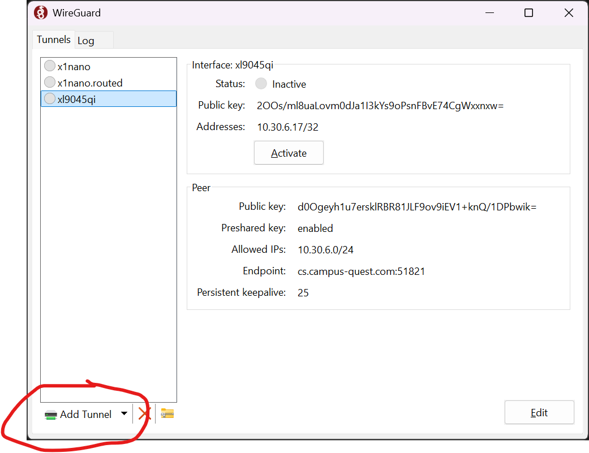
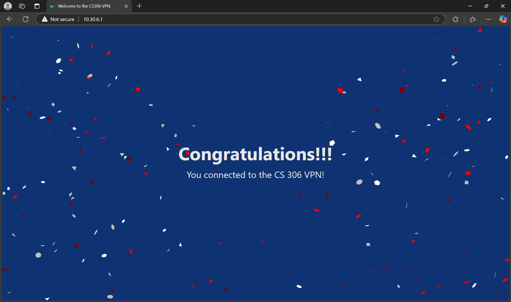

# Connecting to the CS 306 VPN

For this course, you have been given access to a WireGuard VPN instance that will allow you and your classmates to communicate directly with each other's computers despite being in different locations and/or on different networks. You will use the VPN as part of your final group project to test your service with your other group members.

1. Visit the [WireGuard installation page](https://www.wireguard.com/install/) to download the client.

    * Windows users: download the installer and run it.
    * Mac users: follow the link to the App Store, download and install the free client.

1. On the D2L site, go to the Content section and look under "VPN Profiles" **Download the profile that matches your Star ID.** *Do not* download someone else's profile - the IP address you are assigned on the VPN will be part of how you are graded (i.e. if you are coming from the wrong IP, you will lose points!).

    > **DO NOT** make any edits or changes to the profile file. The VPN server does keep track of who is connecting; if there is an IP address mismatch compared with the identity information, you will not be able to communicate over the VPN.

1. Install the WireGuard profile into your client - click "Add Tunnel" and select the downloaded profile

     

1. Click "Activate" to connect to the VPN.

1. To verify that the VPN is functional, visit <http://10.36.0.1> in a web browser. If you are successful you will see a confirmation page - congratulations!

    